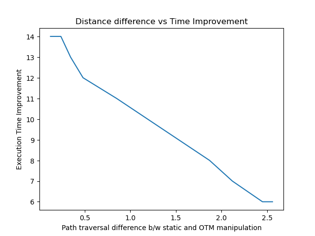

# On the Move Mobile Manipulation (OTM)
The aim of this project is to pick up an object while the base of the mobile manipulator is moving towards the goal. It **improves task execution time by an average of 23%** as compared to the case when the base stops for arm manipulation. This is ahieved by selecting the pick pose for the base and arm through optimization, and coordinating timely execution of arm and base motion while the base heads towards the goal. The system is tested in Gazebo wih a UR5e arm attached to a mobile base, where the robot picks a cuboid shape object from a table.   

## Proposed Architecture:
 
**Hybrid A*** is implemented for path planning of the base. **Regulated Pure Pursuit** is implemented for control of the base. The trajectories of the arm are generated using **Quintic Polynomials** and tracked using **PID** controllers. For optimizing pick pose, a novel cost function is formulated which is optimized using **differential evolution** algorithm. 

## Results
### Path Comparison
OTM Path            |  Static Path
:-------------------------:|:-------------------------:
  |  

Above is the comparison of the path taken by OTM and static mobile manipulaion. Due to some goal locations, OTM has to take a longer path to maximize workspace coverage.

### Task Execution Time Improvement

Above image shows time improvemet we get for OTM manipulaion with the difference in path distance between OTM and static mobile manipulation. 

### Gazebo Simulation

https://github.com/abizerPatanwala/On-the-Move-Mobile-Manipulation/assets/52460321/7c27e3f6-7e3f-4d47-9847-4bb9b3eb65c6

